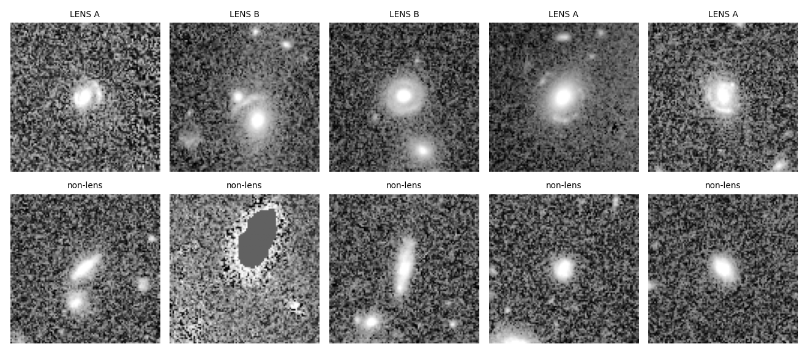
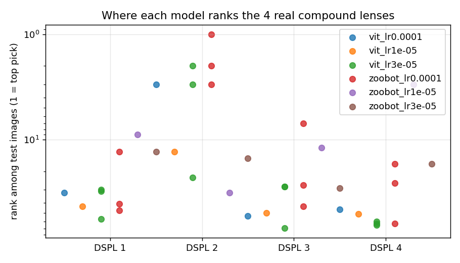
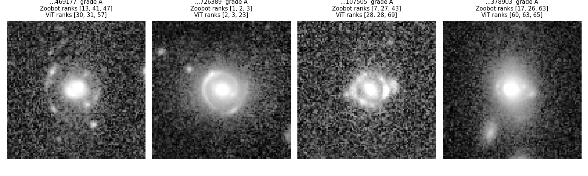

# Ruby: Euclid Q1 Lens Dataset (Zoobot vs. ViT pilot)

Part of **Project Ruby** (ACM Research, UT Dallas, Fall 2026), which studies how well machine-learning
lens finders detect **compound (double-source-plane) gravitational lenses** in Euclid data.

This repo builds a **real-data dataset** from Euclid's first data release (Q1): real lenses plus
real non-lens galaxies, cut into identical images. It is the foundation for a planned comparison of
**Zoobot** (galaxy-pretrained CNN) and a **Vision Transformer** (ImageNet-pretrained) trained on
identical data, evaluated on how highly each ranks the known compound lenses.



## The dataset

| | Count | Source |
|---|---|---|
| **Lenses** (label 1) | **499** (252 grade A, 247 grade B) | Euclid Q1 Strong Lensing Discovery Engine catalog |
| &nbsp;&nbsp;↳ compound lenses (`notes == "dspl"`) | **4** | Same catalog. **Held out for testing only** |
| **Non-lenses** (label 0) | **1,994** | Random Q1 galaxies from NASA/IPAC IRSA |
| **Total** | **2,493** | |

**Every image is a real Euclid observation.** Nothing is simulated.

**Image format:** 100 × 100 pixels of the Euclid **VIS** band at 0.1″/pixel (10″ × 10″), stored as raw
float32 `.npy` files with no scaling applied. This matches the cutout size used by the Euclid Q1
machine-learning paper (Lines et al. 2026), so results are comparable to its Zoobot baseline.

## How it was built

1. **Lenses:** all grade A and B candidates inside the Q1 footprint (the `gz_euclid` subset is outside
   Q1 and excluded). Grade C is excluded as too uncertain.
2. **Non-lenses** (`get_negatives.py`): random galaxies from the Q1 MER catalog, sampled from ~100
   small sky patches across all Q1 fields, with:
   - VIS brightness `flux_detection_total > 3.63 µJy` (IE < 22.5, the cut used by Lines et al. 2026)
   - `spurious_flag = 0` (no junk detections)
   - `point_like_prob < 0.5` (no stars)
   - anything within **10″ of any known lens candidate (grades A, B or C) removed**
3. **Cutouts** (`make_cutouts.py`): **lenses and non-lenses are cut with identical code** from the same
   Euclid MER VIS mosaics, using IRSA's server-side cutout service. This avoids *shortcut learning*,
   where a model tells classes apart by processing differences instead of image content.
   Cutouts with more than 5% missing pixels (survey edges) are skipped (6 of 2,499).

## Reproduce it

```bash
# 1. Environment (Python 3.11; see note below)
uv venv lens_env311 --python 3.11 --seed
source lens_env311/bin/activate
pip install -r requirements-py311.txt astroquery

# 2. Download the lens catalog into this folder:
#    q1_discovery_engine_lens_catalog.csv from https://doi.org/10.5281/zenodo.15003116

# 3. Build the dataset
python get_negatives.py   # ~15-20 min, writes negatives.csv
python make_cutouts.py    # ~20-30 min, writes data/cutouts/ and data/manifest.csv
```

`make_cutouts.py` can be stopped and re-run safely: it skips cutouts that already exist.
`negatives.csv` is committed, so step 3 reproduces the exact same galaxy sample.

### Environment note (macOS 27)
The team's pinned `scipy==1.15.3` fails to load on **macOS 27** (the new OS rejects one of its compiled
files), which also breaks Zoobot, Lightning, scikit-learn and lenstronomy. `requirements-py311.txt` is
the team's `requirements.txt` with **one change: `scipy==1.17.1`**, which requires Python ≥ 3.11.

## Caveats

- **Pilot scale for compound lenses.** Only 4 confirmed compound lenses exist in Q1, so results on them
  should be reported as individual ranks, not percentages.
- **Lenses are expert-graded candidates.** Most are not spectroscopically confirmed; a few grade B
  systems may not be real lenses.
- **Possible hidden lenses among non-lenses.** Roughly 1 in 1,700 Q1 galaxies is a lens, so ~1 unknown
  lens may remain in the 1,994 non-lenses despite the 10″ exclusion. The Euclid paper accepts the same risk.
- **Selection bias.** Many known Q1 lenses were found partly *by Zoobot*, which may favour Zoobot in any
  comparison on this set.

## Experiment: Zoobot vs. Vision Transformer

Both models were fine-tuned on **identical data** (same split, preprocessing, augmentation and
stopping rule) with `train.py`, and compared with `evaluate.py`.

| | Zoobot | ViT |
|---|---|---|
| Architecture | ConvNeXt-Nano (CNN), 15.0M parameters | ViT-Base/16, 85.4M parameters |
| Pretrained on | Galaxies (Galaxy Zoo) | Everyday photos (ImageNet-21k) |
| `timm` name | `hf_hub:mwalmsley/zoobot-encoder-greyscale-convnext_nano` | `vit_base_patch16_224.augreg_in21k` |
| Learning rate (chosen on validation) | 1e-4 | 3e-5 |

**Split** (`data/split.csv`, fixed): 1,741 train (346 lenses) / 373 validation / 379 test
(75 normal lenses + **4 compound lenses** + 300 non-lenses). The compound lenses are never used
for training or tuning.

**Setup:** greyscale VIS, arcsinh stretch, resized to 224x224; random flips and 90-degree rotations;
AdamW with class-weighted cross-entropy; stop after 3 epochs without validation-AUC improvement.
Learning rate picked per model from {1e-4, 3e-5, 1e-5} using **validation AUC only**, then 3 seeds each.

### Results on the held-out test set (mean ± std over 3 seeds)

| Metric | Zoobot | ViT |
|---|---|---|
| Test AUC (all lenses vs. non-lenses) | **0.990 ± 0.003** | 0.974 ± 0.003 |
| Normal lenses in the top 79 (of 75) | 70, 69, 66 | 62, 65, 68 |
| Mean rank of the 4 compound lenses (of 379) | **24.2 ± 2.2** | 38.3 ± 6.7 |
| Inspection cost (images checked to find all 4) | 50.3 ± 9.3 | 64.7 ± 3.7 |





### What this shows

- **Zoobot is the better general lens finder**: higher test AUC in all three seeds, with a model
  about 5x smaller.
- **Both models rank all 4 compound lenses above nearly all non-lenses**, but mostly in the middle
  of the lens ranking, not at the top. Only the brightest, cleanest ring ranks near the top.
- **Zoobot ranks every compound lens higher on average**, but this is **suggestive, not conclusive**:
  there are only 4 lenses, one of them is a near tie, and ranks swing widely between seeds
  (the same lens ranged from 7th to 43rd for Zoobot).

### Limitations

- **Architecture and pretraining are confounded.** The models differ in both, so this cannot say
  which one explains the gap. An ImageNet-pretrained ConvNeXt-Nano would separate them.
- **Small, lens-rich test set.** 1 in ~5 test images is a lens, versus roughly 1 in 1,700 on the sky,
  so these numbers are optimistic for a real survey. Ranks out of 379 are not comparable to the
  Euclid paper's ranks out of ~1 million.
- **No compound lenses in training.** Neither model ever saw one while learning.

### Reproduce

```bash
# pick each model's learning rate on validation (seed 1)
for m in zoobot vit; do for lr in 1e-4 3e-5 1e-5; do python train.py --model $m --lr $lr --seed 1; done; done
# repeat the winners with two more seeds
python train.py --model zoobot --lr 1e-4 --seed 2 && python train.py --model zoobot --lr 1e-4 --seed 3
python train.py --model vit --lr 3e-5 --seed 2 && python train.py --model vit --lr 3e-5 --seed 3
python evaluate.py
```

## Next steps

- [x] `train.py`: fine-tune Zoobot and a ViT on identical splits (compound lenses always in test)
- [x] `evaluate.py`: compound-lens ranks, inspection cost, normal-lens recall (3 seeds each)
- [ ] Add an ImageNet-pretrained ConvNeXt-Nano to separate architecture from pretraining
- [ ] Enlarge the test set with more non-lenses for more realistic ranks
- [ ] Add team-built simulated compound lenses, and a separate "compound" training class

## Data sources and citations

- Lens catalog: Euclid Q1 Strong Lensing Discovery Engine, Zenodo, doi:[10.5281/zenodo.15003116](https://doi.org/10.5281/zenodo.15003116)
- Euclid Q1 MER Catalog, NASA/IPAC IRSA, doi:[10.26131/IRSA602](https://doi.org/10.26131/IRSA602)
- Euclid Q1 MER multiwavelength mosaics, NASA/IPAC IRSA, doi:[10.26131/IRSA601](https://doi.org/10.26131/IRSA601)
- Euclid Collaboration: Lines et al. 2026, *Euclid Q1 XXVIII. The Strong Lensing Discovery Engine C: Finding lenses with machine learning*, A&A 711, A28
